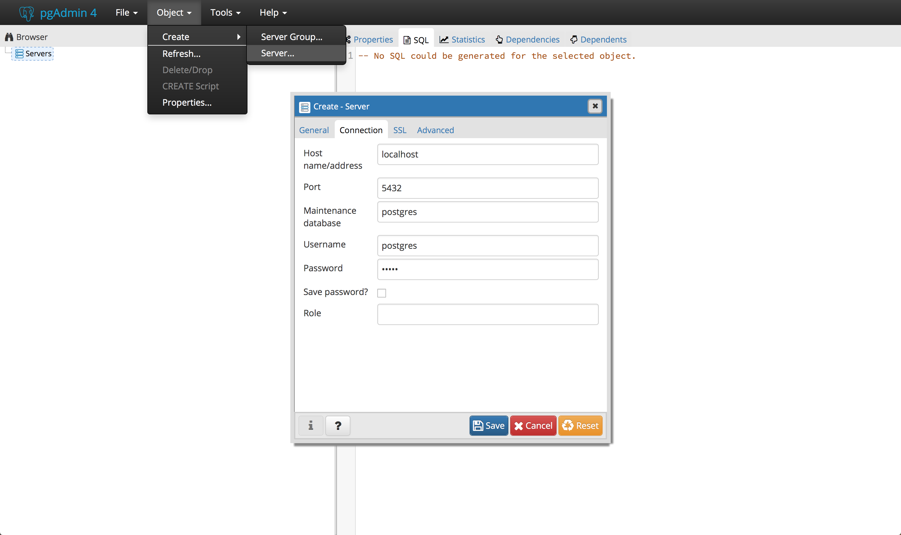
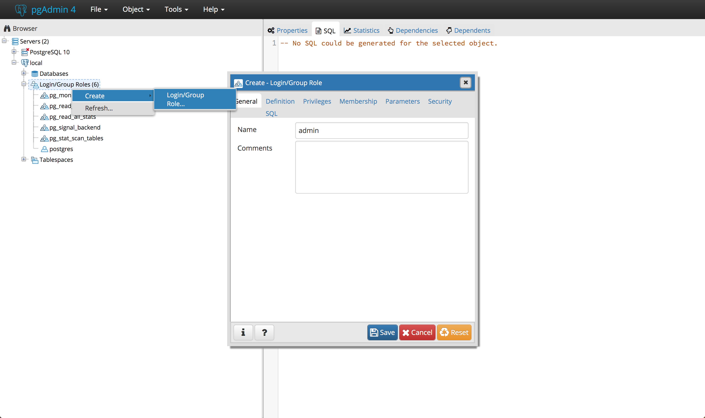
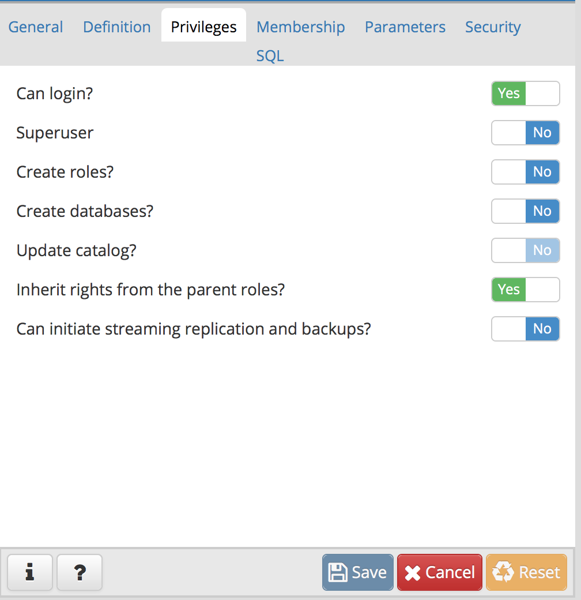
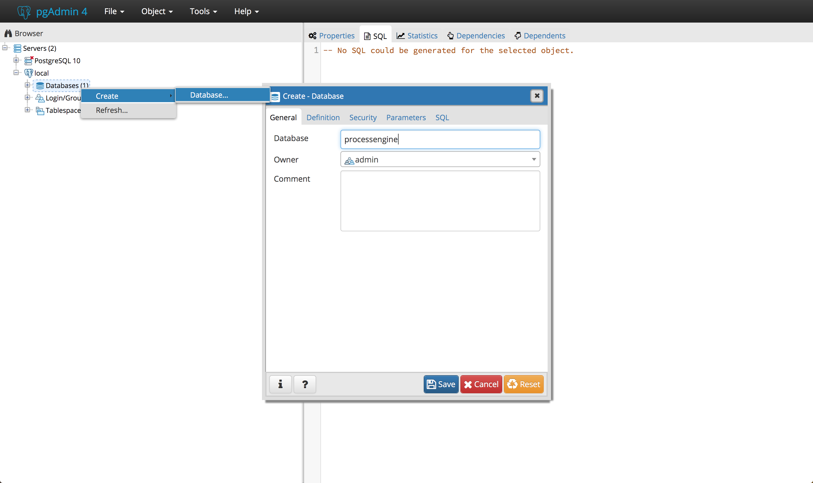
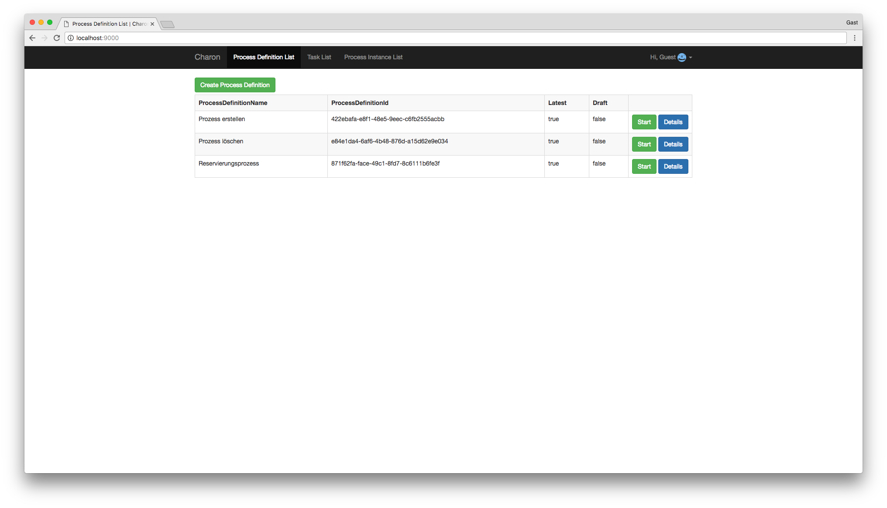

# Installation

Bevor die Prozessengine genutzt werden kann, muss diese erst installiert werden.

Dazu muss das [Skeleton Repository](https://github.com/process-engine/skeleton) geklont werden.
Dieses beinhaltet das minimal Setup, mit dem die Prozessengine ausführbar ist.

```
git clone git@github.com:process-engine/skeleton.git
```

Das Repository besteht aus:

* einem Docker Container mit der Datenbank der Prozessengine
* dem Server der Prozessengine

Als Erstes muss die Datenbank gestartet werden.
Dazu navigiert man in den `database`-Ordner; dort führt
die `postgres_docker.js` mit folgenden Befehl aus:

```
node postgres_docker.js start
```

Alternativ kann man die Datenbank auch ohne Docker ausführen:

Dazu benötigt man PostgreSQL. Dies kann man von folgendem Link runterladen und
wie beschrieben installieren. Dieser Installer installiert auch gleich das
Datenbank-Verwaltungswerkzeug `pgAdmin` mit.

```
https://www.enterprisedb.com/downloads/postgres-postgresql-downloads
```

Nach der Installation führt man pgAdmin aus und fügt über `Object` -> `Create`
-> `Server` einen Server hinzu. Nun erscheint ein Fenster. In dessem
`General`-Reiter kann man einen beliebigen Wert in das `Name`-Feld eintragen. Im
`Connection`-Reiter wählt man als Hostname `localhost` und als Password `admin`
und klickt auf `Save`.



Dieser erscheint dann auf der linken Seite von pgAdmin in der Liste. Dann muss
ein User mit dem Namen `admin` und dem Passwort `admin` erstellt werden. Dazu
erweitert man den Eintrag des Servers in der Liste und rechtsklickt auf
`Login/Group Roles`. Dann klickt man auf `Create` -> `Login/Group Role...`. In
dem nun erscheinenden Fenster wählt man im `General`-Reiter als Name `admin` und
im `Definition`-Reiter als Password `admin`.. Außerdem aktiviert man im
`Privileges`-Reiter die Option `Can Login?` und klickt dann auf `Save`.





Des Weiteren wird eine Datenbank mit dem Namen `processengine` benötigt. Dazu
klickt man rechts auf `Database` und klickt dann auf `Create` -> `Database...`.
Bei Database trägt man `processengine` ein; als Owner wählt man `admin`.
Dies bestätigt man erneut mit `Save`.



Sobald diese gestartet ist geht man in den `process-engine-server`-Ordner.
Dort installiert man zunächst alle Dependencies; dann startet man den Server:

```
npm install
npm start
```

Dann kann Charon gestartet werden.

# Charon

Zunächst muss das [Charon Repository](https://github.com/process-engine/charon)
geklont werden.

```
git clone git@github.com:process-engine/charon.git
```

In dem geklonten Projekt installiert man alle Dependencies;
danach kann Charon gestartet werden.

Diese Befehle erledigen die beiden Aufgaben:

```
npm install
npm start
```

Sobald Charon gestartet ist, kann es über `http://localhost:9000/` aufgerufen
werden.

Das Ergebnis sieht so aus:


