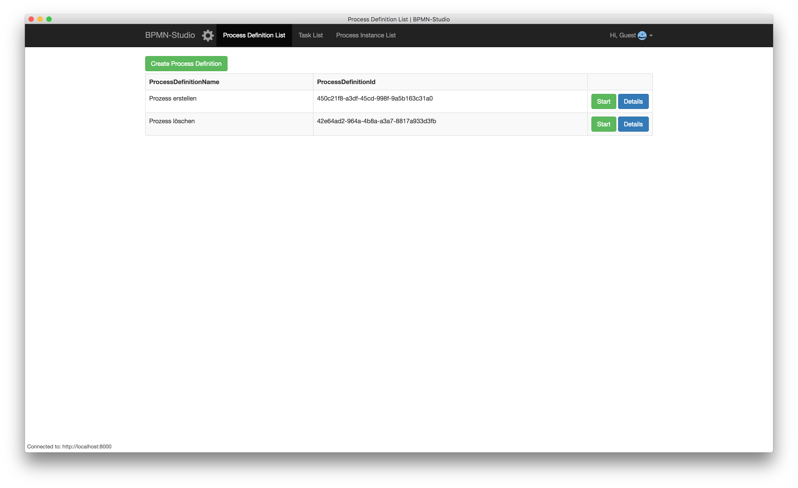

# Installation

## BPMN-Studio

Die aktuellste Version des BPMN-Studios und alle vorherigen Versionen
kann man
[hier](https://github.com/process-engine/bpmn-studio/releases)
herunterladen.

Die `.dmg` Datei kann man anschließend ausführen, um das BPMN-Studio
zu installieren.

Nachdem man das BPMN-Studio installiert hat, kann man es direkt starten
und nutzen. Das Ergebnis sieht so aus:

