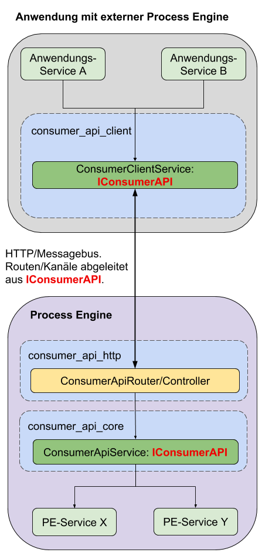

# Beispiel für Client-Server Anwendungen

Dieses Anwendungsbeispiel soll verdeutlichen, wie man die Consumer API in
einer Umgebung einsetzen kann, in welcher eine Anwendung auf die
ProcessEngine einer externen Anwendung zugreift.

Nachfolgend wird dabei die implementierende Anwendung als `Client`
und die externe Anwendung `Server` genannt.

Das komplette Beispiel ist auf [Github](https://github.com/process-engine/consumer_api_meta/tree/feature/add_sample_projects/samples/02_external_process_engine) verfügbar.

