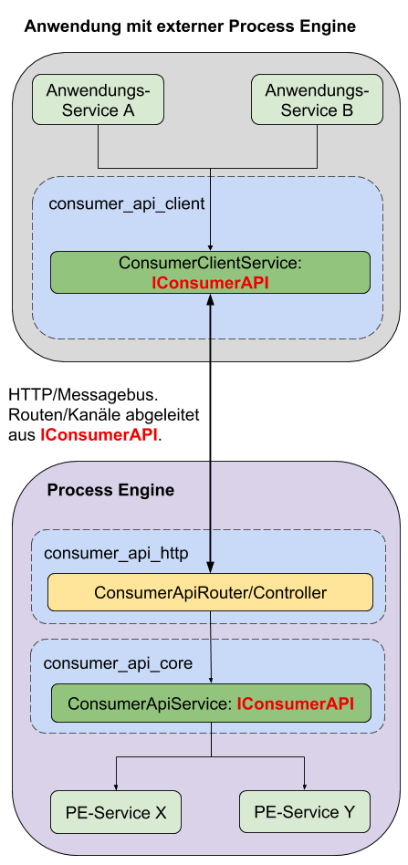

# Einrichtung mit externer ProcessEngine:

Dieser Abschnitt beschreibt die Einrichtung einer ConsumerAPI,
unter Verwendung einer ProcessEngine, die außerhalb der Anwendung liegt.



## Setup

Die externe Anwendung, welche die ProcessEngine implementiert, muss folgende
Pakete installiert haben:
- `@process-engine/consumer_api_core`
- `@process-engine/consumer_api_http`
- `@process-engine/process-engine` - Version 6.0.3 oder höher

Die Anwendung, welche mit der externen Process Engine kommunizieren soll,
benötigt folgende Pakete:
- `@process-engine/consumer_api_client`
- `@process-engine/process-engine` - Version 6.0.3 oder höher

In beiden Anwendungen muss sichergestellt werden,
dass die jeweiligen IoC Module am IoC Container registriert werden.

## Konfiguration

### Externe Anwendung

In der Anwendung, welche die ProcessEngine implementiert, muss eine
Konfiguration für das `@process-engine/consumer_api_core` Paket eingerichtet
werden.

Diese muss unter dem Konfigurationspfad
`consumer_api_core:consumer_api_iam_service` abgelegt werden.

In dieser Datei werden die Claims konfiguriert, mit denen die Benutzer Zugriff
auf die Lanes eines Prozesses erhalten sollen.
  > TODO: Rechtekonzept dokumentieren und hier verlinken

Die Claims werden dabei stehts einem konkreten Benutzer zugeordnet.
Ebenfalls ist zu beachten, dass die zugeordneten Claims dem Namen einer `Lane`
entsprechen müssen.

Beispiel Config:

```js
{
  "claimConfig": {
    "userA": [
      "Lane_A"
    ],
    "userB": [
      "Lane_A",
      "Lane_B"
    ]
  }
}
```

In diesem Beispiel haben wir 2 Benutzer:
- `UserA`: Hat auf alle Lanes mit dem Namen `Lane_A` und `Lane_B` Zugriff
- `UserB`: Hat auf alle Lanes mit dem Namen `Lane_A`, `Lane_C` und `Lane_D` Zugriff

Wichtig ist:
Um sich an der ConsumerAPI zu authentifizeren, ist ein gültiger JWT Token
erforderlich, der einem [ConsumerContext](./public_api.md#consumercontext) mitgegeben wird.

Die ConsumerAPI selbst besitzt jedoch keinerlei Benutzerverwaltung.
Daher muss der Token von der implementierenden Anwendung bereitgestellt werden.

> TODO: Verweis auf IAM Konzept

### Client Anwendung

Per Default verwendet der `ConsumerApiClientService` den Accessor für externe
ProcessEngines.

Dieser verwendet den HttpClient der ProcessEngine, der wie folgt konfiguriert
werden muss:

```js
{
  "url": "http://address-to-external-application"
}

```

`url` bezeichnet dabei die HTTP Adresse, unter der die externe Anwendung
erreichbar ist.

Die Konfiguration muss unter dem Konfigurationspfad `services:http`
abgelegt werden.

Für weiterführende Infos, siehe [Setup ConsumerApiClient](setup-consumer-api-client.md).
