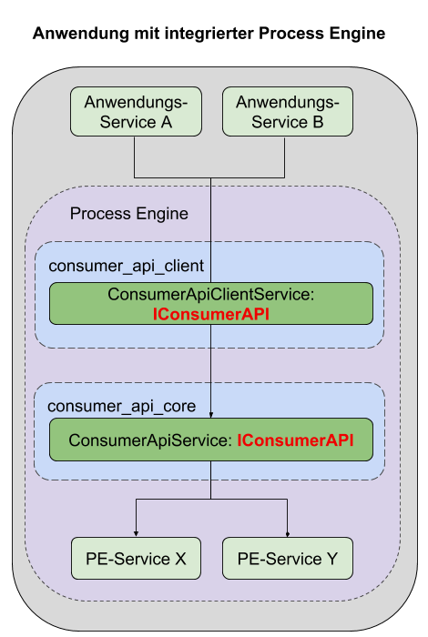

# Einrichtung mit integrierter ProcessEngine:

Dieser Abschnitt beschreibt die Einrichtung einer ConsumerAPI, unter Verwendung
einer ProcessEngine, die direkt in die Anwendung integriert ist.



## Setup

Anwendungen, die eine integrierte ProcessEngine verwenden,
benötigen folgende Pakete:
- `@process-engine/consumer_api_client`
- `@process-engine/consumer_api_core`
- `@process-engine/process-engine` - Version 6.0.3 oder höher

Ebenfalls muss sichergestellt sein, dass die IoC Module der Pakete am Container
registriert sind.

## Konfiguration

### ConsumerApiClient

Siehe [Setup ConsumerApiClient](setup-consumer-api-client.md).

### ConsumerApiCore

Das `@process-engine/consumer_api_core` Paket benötigt eine eigene Konfiguration,
die unter dem Konfigurationspfad `consumer_api_core:consumer_api_iam_service`
abgelegt werden muss.

In dieser Datei werden die Claims konfiguriert, mit denen die Benutzer Zugriff
auf die Lanes eines Prozesses erhalten sollen.
  > TODO: Rechtekonzept dokumentieren und hier verlinken

Die Claims werden dabei stehts einem konkreten Benutzer zugeordnet.
Ebenfalls ist zu beachten, dass die zugeordneten Claims dem Namen einer `Lane`
entsprechen müssen.

Beispiel Config:

```js
{
  "claimConfig": {
    "userA": [
      "Lane_A"
    ],
    "userB": [
      "Lane_A",
      "Lane_B"
    ]
  }
}

```

In diesem Beispiel haben wir 2 Benutzer:
- `UserA`: Hat auf alle Lanes mit dem Namen `Lane_A` Zugriff
- `UserB`: Hat auf alle Lanes mit dem Namen `Lane_A` und `Lane_B` Zugriff

Wichtig ist:
Um sich an der ConsumerAPI zu authentifizeren, ist ein gültiger JWT Token
erforderlich, der einem [ConsumerContext](./public_api.md#consumercontext) mitgegeben wird.

Die ConsumerAPI selbst besitzt jedoch keinerlei Benutzerverwaltung.
Daher muss der Token von der implementierenden Anwendung bereitgestellt werden.

> TODO: Verweis auf IAM Konzept
