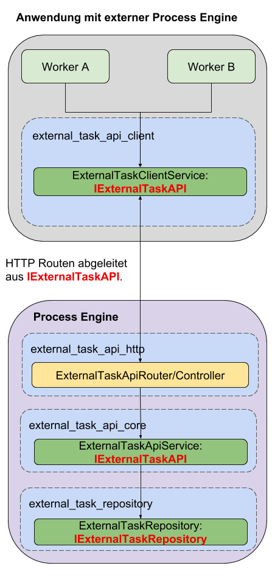

# Einrichtung mit externer ProcessEngine:

Dieser Abschnitt beschreibt die Einrichtung einer ExternalTaskAPI,
unter Verwendung einer ProcessEngine, die außerhalb der Anwendung liegt.



## Setup

Die externe Anwendung, welche die ProcessEngine implementiert, muss folgende
Pakete installiert haben:
- `@process-engine/external_task_api_core`
- `@process-engine/external_task_api_http`
- `@process-engine/external_task.repository.sequelize`
- `@process-engine/process-engine` - Version 6.0.3 oder höher

Die Anwendung, welche mit der externen Process Engine kommunizieren soll,
benötigt folgende Pakete:
- `@process-engine/external_task_api_client`
- `@process-engine/process-engine` - Version 6.0.3 oder höher

In beiden Anwendungen muss sichergestellt werden,
dass die jeweiligen IoC Module am IoC Container registriert werden.

## Konfiguration

### Externe Anwendung

In der Anwendung, welche die ProcessEngine implementiert, muss eine
Konfiguration für das `@process-engine/external_task.repository.sequelize` Paket
eingerichtet werden.

Diese muss unter dem Konfigurationspfad
`process_engine:external_task_repository` abgelegt werden.

Hier wird die Datenbankverbindung konfiguriert, die das Repository für das
Persistieren der ExternalTasks verwenden soll.

Das Repository verwendet dabei Sequelize.
Die Config muss entsprechend ausgelegt sein.

Beispiel Config für SQLITE:

```json
{
  "username": null,
  "password": null,
  "database": null,
  "host": null,
  "port": null,
  "dialect": "sqlite",
  "storage": "some_repository_path/external_task.sqlite",
  "supportBigNumbers": true,
  "resetPasswordRequestTimeToLive": 12,
  "logging": false
}
```

### Client Anwendung

Der externe Accessor des Clients verwendet den HttpClient der ProcessEngine.

Sollte also dieser Accessor benutzt werden, muss noch für den HttpClient eine
Config hinterlegt werden, die folgendermaßen aussehen muss:

```js
{
  "url": "http://address-to-external-application"
}

```

`url` bezeichnet dabei die HTTP Adresse, unter der die externe Anwendung
erreichbar ist.

Die Konfiguration muss unter dem Konfigurationspfad `services:http`
abgelegt werden.

Für weiterführende Infos, siehe [Setup ExternalTaskAPIClient](setup-consumer-api-client.md).
