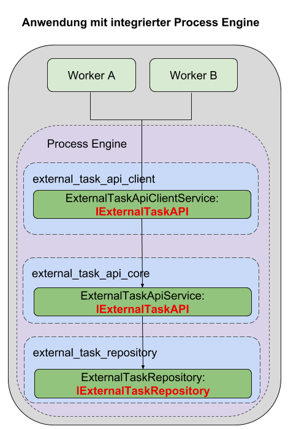

# Einrichtung mit integrierter ProcessEngine:

Dieser Abschnitt beschreibt die Einrichtung einer ExternalTaskAPI, unter Verwendung
einer ProcessEngine, die direkt in die Anwendung integriert ist.



## Setup

Anwendungen, die eine integrierte ProcessEngine verwenden,
benötigen folgende Pakete:
- `@process-engine/external_task_api_client`
- `@process-engine/external_task_api_core`
- `@process-engine/external_task.repository.sequelize`
- `@process-engine/process-engine` - Version 6.0.3 oder höher

Ebenfalls muss sichergestellt sein, dass die IoC Module der Pakete am Container
registriert sind.

## Konfiguration

### ExternalTaskApiClient

Siehe [Setup ExternalTaskApiClient](setup-consumer-api-client.md).

### ExternalTaskApiCore

Das `@process-engine/external_task.repository.sequelize` Paket benötigt eine
eigene Konfiguration, welche unter dem Konfigurationspfad
`process_engine:external_task_repository` abgelegt werden muss.

Hier wird die Datenbankverbindung konfiguriert, die das Repository für das
Persistieren der ExternalTasks verwenden soll.

Das Repository verwendet dabei Sequelize.
Die Config muss entsprechend ausgelegt sein.

Beispiel Config für SQLITE:

```json
{
  "username": null,
  "password": null,
  "database": null,
  "host": null,
  "port": null,
  "dialect": "sqlite",
  "storage": "some_repository_path/external_task.sqlite",
  "supportBigNumbers": true,
  "resetPasswordRequestTimeToLive": 12,
  "logging": false
}
```
