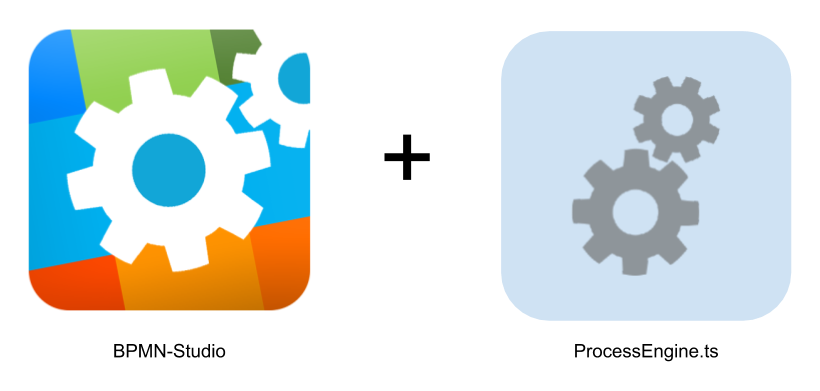
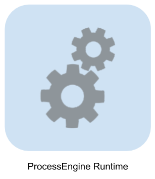

# Setup

Um die Process Engine in einer einfachen Standardkonfiguration zu installieren,
steht ein [Skeleton-Projekt](https://github.com/process-engine/skeleton) zur
Verfügung, das mehrere vorkonfigurierte Setups enthält.

## Zum Testen

Die Process Engine kann am besten zusammen mit dem BPMN-Studio getestet werden.

Mit dem BPMN-Studio lassen sich bequem BPMN-Diagramme erstellen oder bearbeiten
und vorhandene BPMN-Diagramme als Prozesse starten.

Es gibt zwei Möglichkeiten das BPMN-Studio mit integrierter Process Engine zu
beziehen:
* als [Standalone
  Software](https://github.com/process-engine/bpmn-studio/releases)
* in einem [Docker
  Container](https://github.com/process-engine/skeleton/tree/develop/full-docker-image)

## Für Entwickler {#entwickler}

Die ProcessEngine Runtime bietet die Möglichkeit einen vorkonfigurierten
Process Engine Server zu installieren.

Die Installation der Software erfolgt über den Paketmanager NPM.

Eine detaillierte Installationsanleitung befindet sich in der [README des
Github-Projects](https://github.com/process-engine/process_engine_runtime#requirements).

