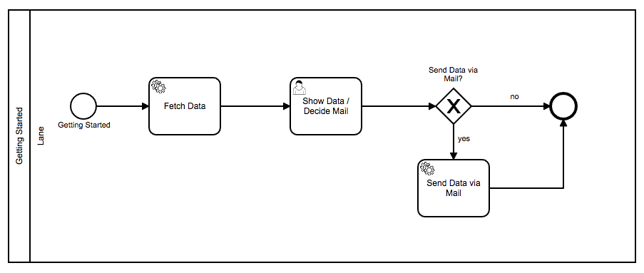

# Quick Start

During the course of this quick start guide you will learn how to model simple use cases using the process engine.

We will take a look at how to model the BPMN process itself using the BPMN standard. In further steps we will integrate the BPMN process with the process engine so that we can execute it.

Our goal with this quick start guide is to create a whole BPMN process step by step.

The resulting BPMN process will look something like this:

