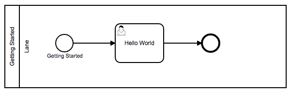
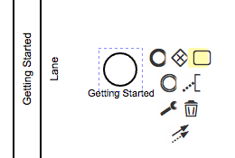
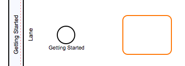
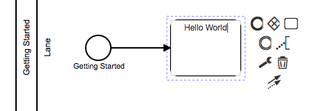

# Hello World

Let's start with the all time classic example `Hello World`.

We want to execute BPMN diagram with a single user task. 

This user task is supposed to show us the `Hello World` message as well as a confirm dialog to finish the user task. 

## Creating a new diagram

First we need to create a new diagram.

Open the process manager and click on the `+`-button on the top left to create a new process.

You need to specify the name of the process and the key used to reference the diagram.

For now, let's just use `Hello World` for both.

If you double click on the newly created diagram you get into the detail view.

---

Now you can see the BPMN editor showing your diagram with only a lane and a start event.

If you select the start event you will see the context menu for the selected element.

You can use it to create a user task that will automatically be connected to the selected element.

# Consuming a REST API
a

a

a

a

a
a

a

a

a

a

# Sending Mail
a
a
a
a
a
a
a
a
a
a