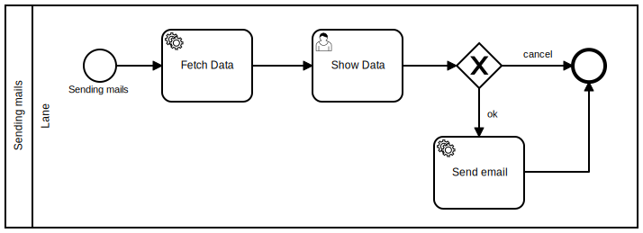

# Hands on!

In this part, you'll quickly learn the basics of handling the process-engine.

We start with a simple hello-world, then move on to consuming an API, and finally send a mail with a condition.

The final process will look like this:

