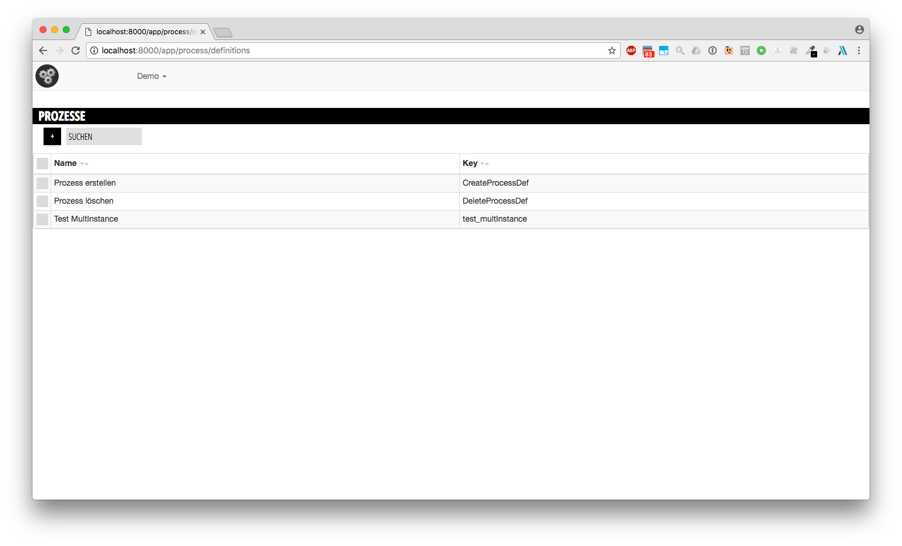

# Setup

Before we start using the process engine you need to install it on your machine.

You can start by cloning the [skeleton repository](https://github.com/ProcessEngineJS/skeleton). It contains a minimal setup of the process engine that you can use right away.

```
git clone git@github.com:ProcessEngineJS/skeleton.git
```

The repository consists of two parts:
* a docker container with the process engine database 
* the process engine server

The skeleton repository contains a `README.md` that explains the detailed steps required to run the process engine.

> Note: you have to start the database **before** you start the process engine server.

If you successfully started the process engine you can view the web UI at `http://localhost:8000/app`.

## Process Manager

You can view a list of all processes by clicking on the `Demo`-dropdown at the top and selecting `ProzessManager`.

