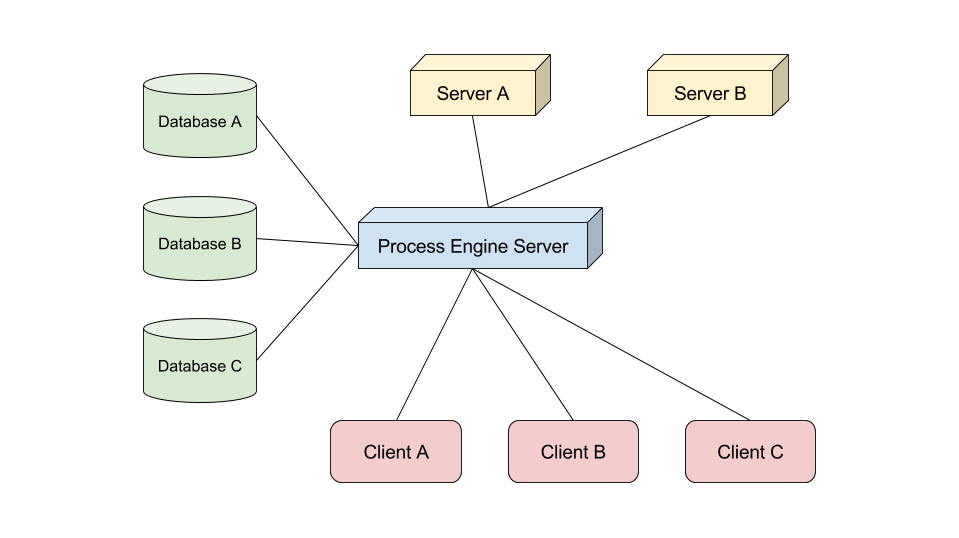
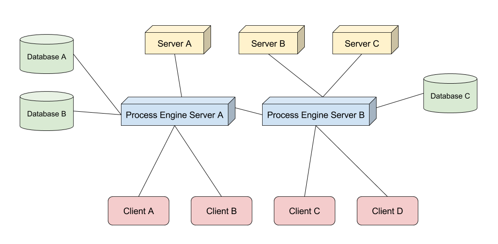

# Typical Setups

## Single Server

In a setup with a single process engine server, this server:
* Knows database servers relevant to BPMN processes
* Knows other servers that may play a part in a BPMN process
* Serves all the clients running the process engine frontend

## Multiple Servers

When running multiple process engine servers, each server:
* Knows some or all of the database servers relevant to BPMN processes
* Knows some or all other servers that may play a part in a BPMN process
* Serves some clients running the process engine frontend
  * This is usually split by a load balancer (or by use cases in a heterogeneous setup (see 2.2.2 Heterogeneous Setup))

### Homogeneous Setup

In a homogeneous server setup each of the process engine servers is deployed with the same components and has access to the same ressources.

This makes scaling the system easy, because you can scale it by increasing the number of the machines running the process engine.

### Heterogeneous Setup

In a heterogeneous server setup you have multiple servers running the process engine. But each of the servers can have different components or ressources. That means not every instance can perform every action. Instead if a system cannot execute the request action, it will hand it off to another process engine server that is capable of executing it.
