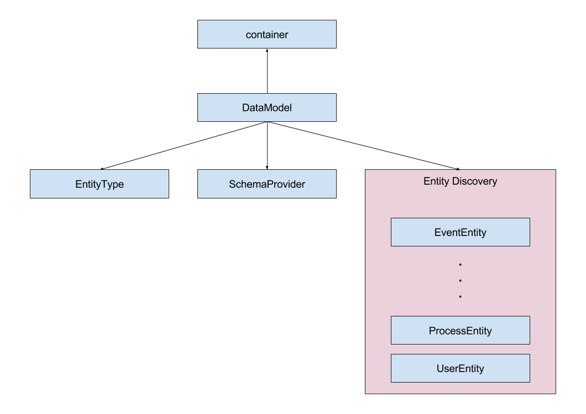

# Module Interaction

When using a stack with so many classes we will have classes that depend on other classes to do their job. There will likely be a whole lot of such dependencies so that we need a uniform way of dealing with them to prevent chaos.

We achieve this by using an IoC container that we register all dependencies to. 
The result of all registrations is what we call the dependency graph.

## Dependency Graph

Whenever we need a class instance we will let the IoC container take care of instantiating it and resolving its dependencies.

If you're not used to the inversion of control pattern you might see this as an overhead. But it is just the opposite.

Except from places where you're dealing with highly dynamic dependencies, all classes will be instantiated because they are a dependency to another class.

That results in cleaner, easy-to-maintain code and enables us to use additional features based on the dependency graph.

## Dependency Injection

We use [addict-ioc](https://github.com/5minds/addict-ioc) as our IoC container.

A detailed documentation can be found on its [GitHub](https://github.com/5minds/addict-ioc) page.

We use the constructor injection to inject dependencies into instances.

### IoC Modules

Our stack is split up into modules. When we build an application from those modules we might want one application to use all of the modules while another application only needs a part of those modules.

For clear separation of the modules we decided to organize each modules registrations to the IoC container inside its own module.

By convention you can find this module in the root folder as `ioc_module.js`.

When the `ioc_module.js` is registered to the IoC container it is expected to register everything that module has to offer.

But there are use cases where you want to overwrite certain module classes with your own. In such cases you want more granular control over which registrations of the module are loaded.

Next to the `ioc_module.js` you will find files like `ioc.services.js` or `ioc.entity_types.js`.

Those files - let's call them IoC parts - contain just a certain category of registrations.

The `ioc_module.js` is responsible to load all IoC parts so that the person or program using the module does not have to know its IoC parts to load it.

### Discovery

Whenever there is a dynamic branch in our dependency graph we use a discovery mechanism that is based on the registrations on the IoC container.

In this example the `DataModel` has a dependency on the `container` (which is the IoC container instance itself) and among others it has a dynamic dependency on entities. The dependency graph is not aware that the `DataModel` uses entities, the `DataModel` just asks the `container` for all registrations that are tagged as an entity.

With this mechanism the number of entities can vary amongst applications without the need of changing the underlying code.

The current discoveries are:

Discovery Tag | Description
---------|----------
 Schema | JSON Schemas based on the TypeScript Definitions
 Entity | Classes derived from the `Entity` base class the generic `EntityType` consumes
 Router | Classes derived from the `RouterBase` base class the `HttpExtension` consumes
 Extension | Classes following the extension pattern of the bootstrapper
 TokenAdapter | Classes implementing the `ITokenAdapter` interface the `TokenService` consumes 
 FeatureGenerator | Classes following the generator pattern of the `FeatureService`
