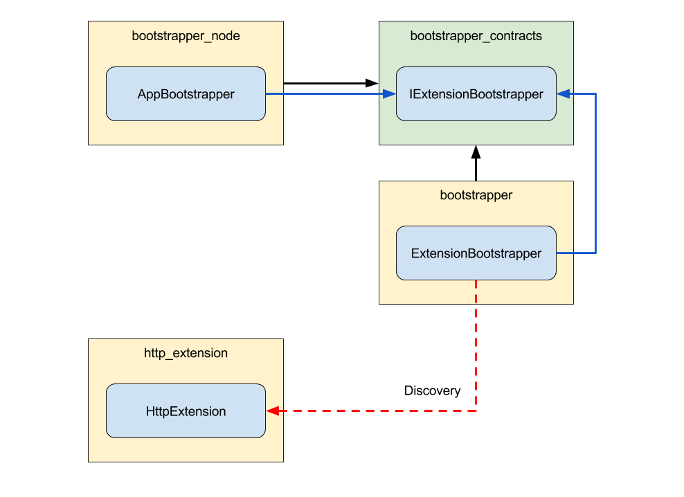

# Structure

Each module can be placed inside a category. For consistency we apply a naming convention to these categories:

package name | description
---------|----------
 messagebus | the isomorphic base module
 messagebus_contracts | the interfaces that represent the base module
 messagebus_http | the http bridge for the base module
 messagebus_adapter_faye | an adapter for the base module

## Contracts

We learned already that modules are regular npm packages with dependencies. When dealing with a stack of this size we need to make sure that every component is exchangable through dependency injection without changing the code.

Imagine we have a class `ReportingService` in a module `reporting` that depends on the class `LoggingService` from the module `logging`.

The npm package `reporting` would not have a dependency on `logging`, but rather on `logging_contracts`.

Also the class `ReportingService` would not reference the class `LoggingService`. Instead it uses the interface `ILoggingService` from `logging_contracts`.

Now that the `reporting` module has no references to the implementation, we can completely change the implementation through dependency injection as long as our replacement fulfills the contract (implements the interface).

## Bridges

When we need to tie one base module to another we want to do it in a way that keeps them loosely coupled. This means that the implementations we tied together are completely independent from one another.

We achieve the loose coupling by putting all the glue that ties modules together into bridge modules.

One example you will often find are `http`-bridges. Normally base module mostly contain services that encapsulate logic.

If we want to expose service logic via a HTTP endpoint we have to define which HTTP routes and methods can be used to execute the service logic. The code that does this resides in the bridge module.

Usually bridge modules are discovered using _Inversion of Control_ (see 3.1).

## Adapters

Adapters are very similar to bridges, but have one important difference. They provide the glue needed to tie a base implementation of our stack to a third party component or technology outside of our stack.

The prime example for this are the data source adapters used in our stack.

For each third party database technology we want to support, we need an adapter that knows how our generic data layer can be tied to the database so that both will work together. 

## Extensions

The entry point for the whole stack is the `AppBootstrapper`. It uses the `ExtensionBootstrapper` to discover extensions. After discovering them the `ExtensionBootstrapper` has two phases. First it initializes all extensions by calling the `initialize`-method. Then it starts them by calling the `start`-method.

When the two phases have completed and the bootstrapper is done, the application is considered as `started`.

Although extensions are technically suited for all kinds of uses we solely use them to represent the communication endpoints of an application.

For example, the `HttpExtension` starts a HTTP server and discovers components that can register routes on the HTTP server. An `AmqpExtension` could do something similar to that with the AMQP protocol.

