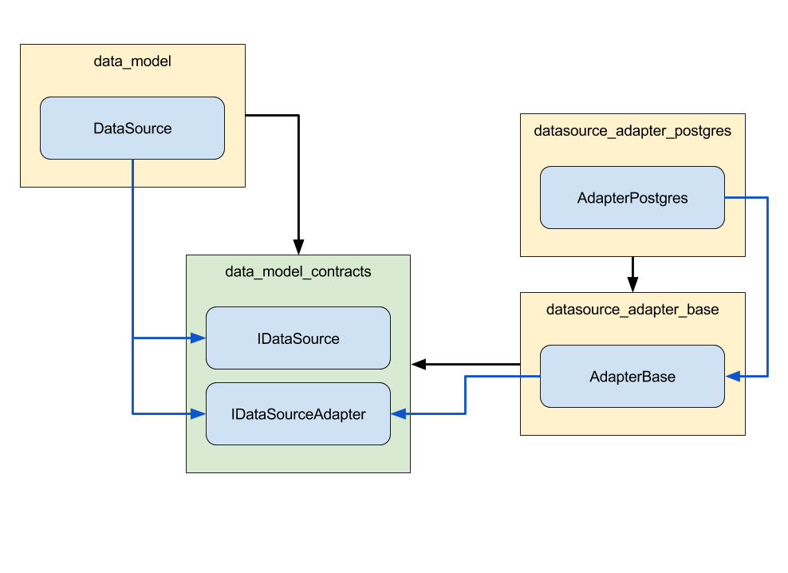

## Adapters

Adapters are very similar to bridges, but have one important difference. They provide the glue needed to tie a base implementation of our stack to a third party component or technology outside of our stack.

The prime examples for this are the data source adapters used in our stack.

For each third party database technology we want to support, we need an adapter that knows how our generic data layer can be tied to the database so that both will work together. 

